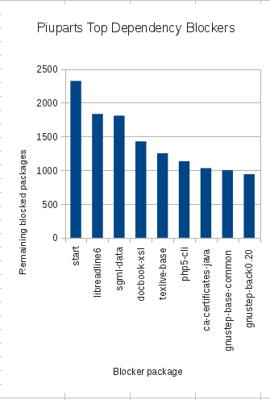
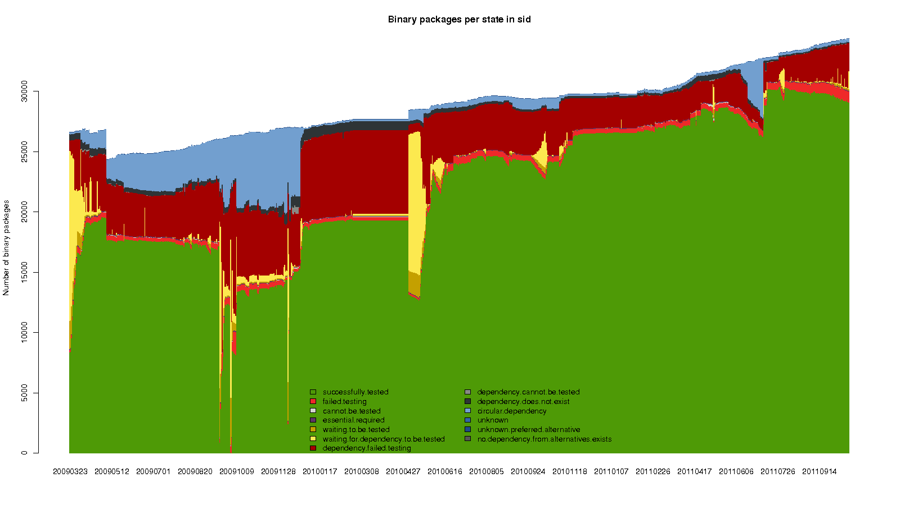

This code is a quick hack that analyzes Debian sid piuparts_ packages that are in state-dependency-failed-testing_, and prints out information on the failed packages which are blocking their testing.

.. _piuparts: http://piuparts.debian.org/
.. _state-dependency-failed-testing: http://piuparts.debian.org/sid/state-dependency-failed-testing.html

The output consists of:

* the number of packages in state-failed-dependency-testing which have been traced to a state-failed-testing package
* the number of packages in state-failed-testing causing the dependencies
* the list of state-failed-testing packages sorted by impact, with:

 - the number of packages blocked by this package
 - the number of packages which only depend on this package, and
 - the number of packages left in state-failed-dependency-testing after this package and the ones above it pass

Example::

    # ./piublocker
    dependency failed -  2324
    failed testing -  258

    blocking free cum  package
    1037     489  1835 libreadline6
     429      22  1809 sgml-data
     421       1  1429 docbook-xsl
     186     150  1252 texlive-base
     162     106  1135 php5-cli
     154      78  1032 ca-certificates-java
      90      29  1003 gnustep-base-common
      61       0   942 gnustep-back0.20
      49       4   926 libcommons-httpclient-java

The cumulative effect of removing the top blocking failed packages on this date can be seen here:

This is a typical distribution of packages states in Debian sid piuparts. The packages in state-dependency-failed-testing are in dark red (from http://piuparts.debian.org/sid/)

The application parses http://piuparts.debian.org/sid/state-dependency-failed-testing.html to gather package data. The information is stored locally in the file piudata.json, to speed up subsequent runs. Delete the file to cause the data to be downloaded again.

`BeautifulSoup <http://www.crummy.com/software/BeautifulSoup/>`_ must be installed.

The number of packages counted in state-failed-dependency-testing is less than that reported by the web page, possibly because it only counts packages which trace directly to a failed-dependency-test package.

The code is not a model of cleanliness, or efficiency.

.. David Steele

